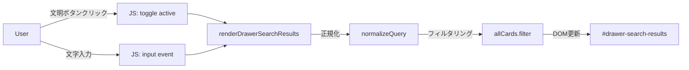

# コレクション検索ドロワー実装プラン

## 目的
コレクション画面において、下からスライドしてくるドロワー内に、文明フィルターボタンとフリーワード検索欄を統合し、添付画像のレイアウトを再現する。

## 画面構成案
ドロワー（`#search-drawer`）の上部に以下の要素を1行（または折り返し）で配置する：
1. **文明フィルターボタン群**: 光、水、火、自然、闇、ゼロ、多色、単色のアイコン。
2. **並べ替え/追加条件（必要に応じて）**: 画像にある「単色」ボタンや並べ替えセレクト。
3. **フリーワード検索バー**: 「フリーワード | 検索ワードを入力...」というプレースホルダー。
4. **設定アイコン（歯車）**: 画像の右端にあるアイコン。

## 技術的アプローチ
- **HTML**: `index.html` の `#search-drawer` 内の構造を整理し、必要なクラスを付与する。
- **CSS**: `.drawer-civ-filter` などの既存クラスを修正し、横並びのレイアウト（Flexbox）とボタンの形状（角丸、背景色）を調整する。
- **JS**: 
  - `renderDrawerSearchResults` 関数を拡張し、ドロワー内の文明ボタンの `active` 状態と `drawer-search-input` の値を同時に考慮するようにする。
  - 文明ボタンのクリックイベントで再検索を実行する。
  - 検索ロジック（`filtered` の部分）はメインの `renderSearchResults` と同様の正規化を行う。

## Mermaid ダイアグラム

## TODO リスト
1. **CSSの調整**: 文明ボタンのデザインをグレー基調に、選択時を濃くする。
2. **HTMLの整理**: ドロワー内のヘッダー下にフィルターバーと検索バーを配置。
3. **JSの実装**:
   - 文明ボタンのイベントリスナー（ドロワー専用）。
   - 検索キーワードと文明フィルターを組み合わせたフィルタリング。
   - カードアイテムの生成とドラッグ設定（既存機能の維持）。
