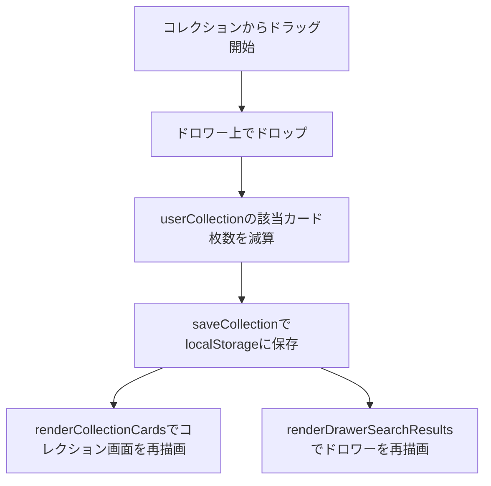

# コレクション→ドロワー ドラッグ&ドロップの不具合修正計画

## 現状の問題点
1. コレクションモードでコレクションからドロワー（検索追加エリア）へカードをドラッグ＆ドロップした際、枚数が即座に減算されて画面に反映されない。
2. ページをリロードすると編集内容が消えてしまう（`saveCollection()` 関数が未定義または `localStorage` に正しく保存されていない）。

## 修正方針

### 1. `saveCollection()` 関数の実装・定義
- `localStorage.setItem('tcg_collection', JSON.stringify(userCollection))` を呼び出す共通関数 `saveCollection()` を確実に定義する。

### 2. ドロワー側のドロップイベント（`drawerResultsGrid`）の修正
- コレクション（`sourceArea === 'collection'`）からドロワーにカードがドロップされた際、以下の処理を確実に実行する：
  1. `userCollection[cardName]` の減算（0以下になったら `delete userCollection[cardName]`）。
  2. `saveCollection()` の呼び出しによる `localStorage` への永続化。
  3. コレクション画面が表示されている場合は `renderCollectionCards()` を呼び出して即座に再描画。
  4. ドロワー検索結果側も `renderDrawerSearchResults()` を呼び出して再描画。

### Mermaidによる処理フロー図

