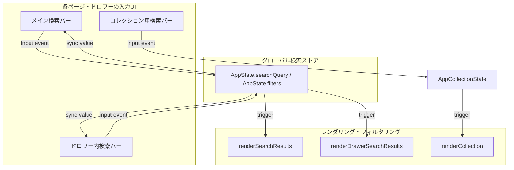

# 検索クエリ連携の改善プラン（詳細版）

[`plans/search_query_improvement.md`](plans/search_query_improvement.md) で作成したプランをベースに、具体的なコード設計と各ページの連携仕様をさらに詳細に定義します。

## 1. 検索クエリの「レイを上げる」設計思想
現状のアプリでは、メイン検索バー（`search-input`）、検索ドロワー（`drawer-search-input`）、コレクション検索（`collection-search-input`）の各入力値が独立、または部分的にしか同期していません。
これを「レイを上げる」ために、以下の階層構造へリファクタリングします。

## 2. 具体的な実装ステップ（詳細）

### ステップ1: 状態管理オブジェクトの導入（または拡張）
[`app.js`](app.js) 内に、検索クエリと各種フィルター条件を保持するオブジェクトを定義し、各入力要素の変更時に必ずこのステートを経由するようにします。
- `state.searchQuery`: 現在のメイン検索キーワード
- `state.subSearchConditions`: サブ検索の条件配列
- `state.filters`: コスト・パワー・文明などのフィルター条件

### ステップ2: 双方向バインディング（Sync）の実装
- メイン検索バー (`search-input`) とドロワー検索バー (`drawer-search-input`) の間で、一方に入力されたときにもう一方の `value` も自動的に書き換えるリスナーを設置する。
- これにより、ユーザーがどの画面から検索しても文字のズレが発生しなくなります。

### ステップ3: ビュー切り替え時の状態保持
- タブ切り替え（ホーム ⇄ 検索 ⇄ コレクション ⇄ マーケット）を行っても、`state.searchQuery` がクリアされないよう制御を見直す（※初期化ボタンを押したときのみ明示的にクリアする）。

### ステップ4: コレクション検索の分離と明確化
- コレクション画面 (`collection-search-input`) はマイコレクション固有の絞り込みであるため、全体検索とは独立した専用スコープとして維持しつつ、UI上のプレースホルダーやラベルを分かりやすく整理する。
