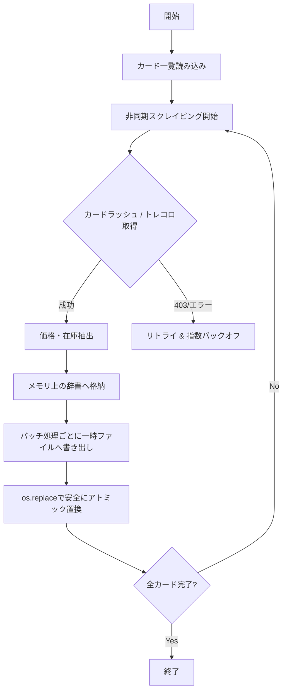

# [`update_prices.py`](update_prices.py) 改善計画

## 概要
[`update_prices.py`](update_prices.py) における現在の課題（HTTPブロック耐性、ファイル破損リスク、例外ハンドリング、型番抽出）を解消するための改修計画。

## 改善項目

### 1. HTTPステータスコード・レートリミット対策の強化
- トレコロ側での403/429/503エラー検知およびリトライロジックの追加
- 指数バックオフ（Exponential Backoff）を用いたウェイト調整

### 2. アトミック書き込み（安全なJSON保存）の導入
- 一時ファイル（`.tmp`）へ書き込んだ後に [`os.replace()`](https://docs.python.org/ja/3/library/os.html#os.replace) で置き換える方式に変更
- 途中中断やクラッシュ時のデータ破損を防止

### 3. 例外ハンドリングとログ出力の改善
- `except Exception as e:` でエラー内容を出力するようにし、どのカードでどのような原因（パースエラー、タイムアウトなど）で失敗したかを把握しやすくする

## アーキテクチャ / ワークフロー

